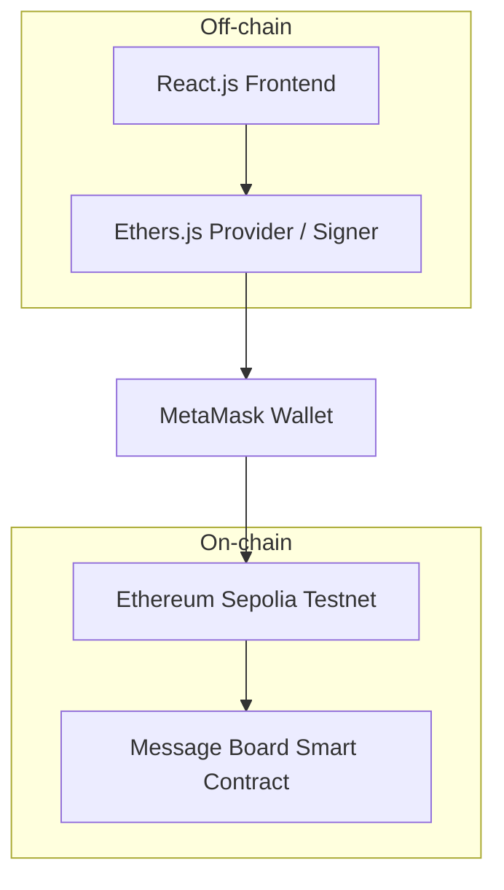

<div align="center">
  
  
  <br/>
  
  # 🌐 Decentralized Message Board (DApp)
  
  **A foundational Decentralized Application (dApp) research project developed for the IE213 course, enabling users to interact with a Smart Contract on the Ethereum Sepolia network to store and display messages transparently.**

[](https://soliditylang.org/)
[](https://reactjs.org/)
[](https://docs.ethers.org/)
[](https://metamask.io/)

</div>

---

## ✨ Features

- **Web3 Wallet Connection:** Integrated with MetaMask for secure user authentication via wallet addresses.
- **On-chain Interaction:** Read data directly from the Smart Contract and send transactions to mutate blockchain state.
- **Transaction State Management:** Clear visibility of transaction phases: Pending, Success, and Failed.
- **Optimized UX:** Robust handling of edge cases like rejected transactions, network switching, and RPC connection errors.

## 🏗 Architecture



## 🛠 Tech Stack

| Layer     | Technology                          |
| :-------- | :---------------------------------- |
| Frontend  | React.js                            |
| Web3      | Ethers.js, MetaMask                 |
| Contract  | Solidity, Remix IDE                 |
| Network   | Ethereum Sepolia Testnet            |

## 📝 Smart Contract Information

| Detail | Value |
| :--- | :--- |
| **Network** | Ethereum Sepolia Testnet |
| **Contract Address** | `0xF3D27FB817dCD549C885dA7ff869f9B5f36dAE5b` |
| **Explorer** | [View on Blockscout](https://eth-sepolia.blockscout.com/address/0xF3D27FB817dCD549C885dA7ff869f9B5f36dAE5b) |

## 🚀 Getting Started

**Prerequisites:**

- **Node.js 18+**
- **Browser with MetaMask extension installed** (switched to Sepolia network with testnet ETH)
- **Git**

### Step 1: Clone the repository

```bash
git clone https://github.com/ducpham211/web3-bulletin-hybrid.git
cd web3-bulletin-hybrid/frontend
```

### Step 2: Install dependencies

```bash
npm install
```

### Step 3: Run the application

```bash
npm run dev
# Open your browser at http://localhost:5173
```

> **Important Note:** Ensure your MetaMask is switched to the **Ethereum Sepolia Testnet** before performing any transactions on the DApp.

## 📂 Project Structure

The system follows an On-chain and Off-chain data separation model to optimize performance:

```text
web3-bulletin-hybrid/
├── frontend/
│   ├── src/             # React UI source code and off-chain processing logic
│   ├── package.json     # Dependency configuration (React, Ethers.js)
│   └── ...
└── README.md            # Project documentation
```

## 🔌 Core Smart Contract Overview

| Method | Type | Description | Auth |
| :----- | :--- | :---------- | :--: |
| `getMessage` | Read | Retrieves the current message stored on-chain | ❌ |
| `setMessage` | Write | Sends a transaction to update the message (requires Gas fees) | ✅ |

## ✍️ Author

**Pham Viet Duc** - [GitHub](https://github.com/ducpham211)

- [LinkedIn](https://linkedin.com/in/viet-duc-pham)
