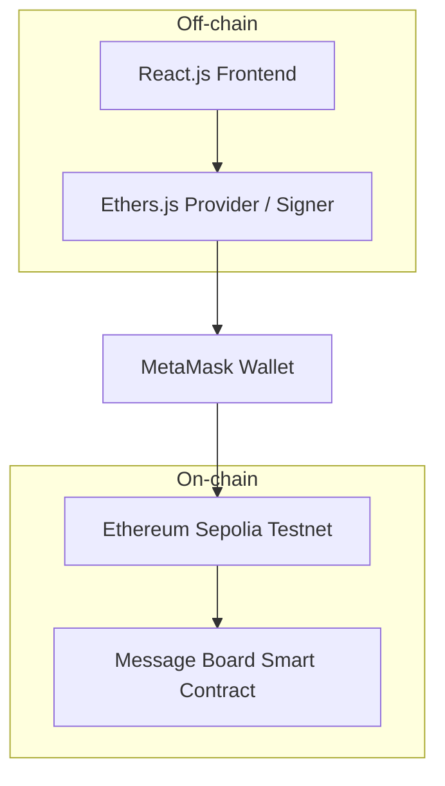

<div align="center">
  
  
  <br/>
  
  # 🌐 Decentralized Message Board (DApp)
  
  **Dự án nghiên cứu nền tảng ứng dụng phi tập trung (dApp) thuộc đồ án môn học IE213, cho phép người dùng tương tác với Smart Contract trên mạng Ethereum Sepolia để lưu trữ và hiển thị tin nhắn minh bạch.**

[](https://soliditylang.org/)
[](https://reactjs.org/)
[](https://docs.ethers.org/)
[](https://metamask.io/)

</div>

---

## ✨ Features

- **Web3 Wallet Connection:** Tích hợp MetaMask để xác thực người dùng thông qua địa chỉ ví.
- **On-chain Interaction:** Đọc dữ liệu trực tiếp từ Smart Contract và gửi giao dịch thay đổi trạng thái trên blockchain.
- **Transaction State Management:** Quản lý rõ ràng các trạng thái: Đang chờ xác nhận (Pending), Thành công (Success), Thất bại (Failed).
- **Optimized UX:** Xử lý mượt mà các tình huống như từ chối giao dịch, đổi mạng hoặc lỗi kết nối RPC.

## 🏗 Architecture



## 🛠 Tech Stack

| Layer     | Technology                          |
| :-------- | :---------------------------------- |
| Frontend  | React.js                            |
| Web3      | Ethers.js, MetaMask                 |
| Contract  | Solidity, Remix IDE                 |
| Network   | Ethereum Sepolia Testnet            |

## 📝 Smart Contract Information

| Detail | Value |
| :--- | :--- |
| **Network** | Ethereum Sepolia Testnet |
| **Contract Address** | `0xF3D27FB817dCD549C885dA7ff869f9B5f36dAE5b` |
| **Explorer** | [View on Blockscout](https://eth-sepolia.blockscout.com/address/0xF3D27FB817dCD549C885dA7ff869f9B5f36dAE5b) |

## 🚀 Getting Started (Hướng dẫn cài đặt chi tiết)

**Yêu cầu hệ thống (Prerequisites):**

- **Node.js 18+**
- **Trình duyệt có cài đặt tiện ích MetaMask** (đã chuyển sang mạng Sepolia và có testnet ETH)
- **Git**

### Bước 1: Clone dự án và truy cập thư mục

```bash
git clone https://github.com/ducpham211/first-web3-repo.git
cd first-web3-repo/frontend
```

### Bước 2: Cài đặt dependencies

```bash
npm install
```

### Bước 3: Khởi chạy ứng dụng

```bash
npm run dev
# Mở trình duyệt tại http://localhost:5173
```

> **Lưu ý quan trọng:** Đảm bảo MetaMask của bạn đã được chuyển sang mạng **Ethereum Sepolia Testnet** trước khi thực hiện các giao dịch trên DApp.

## 📂 Project Structure (Cấu trúc dự án)

Hệ thống tuân thủ mô hình tách biệt dữ liệu On-chain và Off-chain để tối ưu hiệu năng:

```text
first-web3-repo/
├── frontend/
│   ├── src/             # Mã nguồn giao diện React và logic xử lý off-chain
│   ├── package.json     # Cấu hình thư viện (React, Ethers.js)
│   └── ...
└── README.md            # Tài liệu dự án
```

## 🔌 Core Smart Contract Overview

| Method | Type | Description | Auth |
| :----- | :--- | :---------- | :--: |
| `getMessage` | Read | Truy xuất nội dung tin nhắn đang được lưu trữ trên on-chain | ❌ |
| `setMessage` | Write | Gửi giao dịch cập nhật tin nhắn mới (yêu cầu thanh toán Gas phí) | ✅ |

## ✍️ Author

**Pham Viet Duc** - [GitHub](https://github.com/ducpham211)

- [LinkedIn](https://linkedin.com/in/viet-duc-pham)
